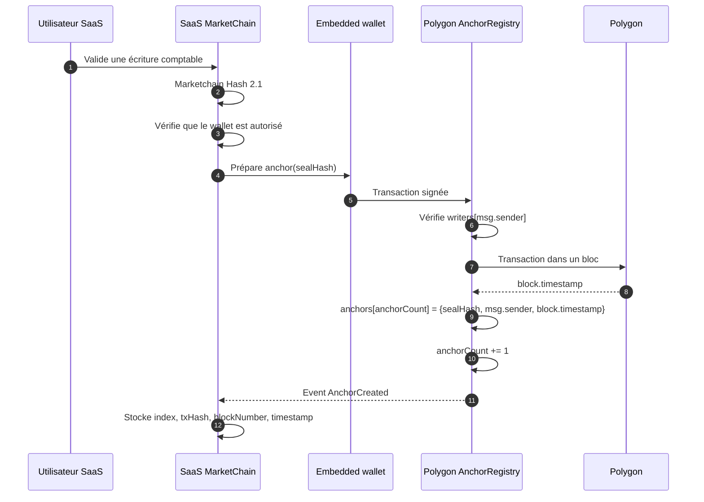

# marketchain-contract

## Présentation

**MarketChainAnchorRegistry** est un smart contract Solidity déployable sur Polygon PoS. En V1, il agit comme un registre append-only : il stocke des `sealHash` (Marketchain Hash 2.1) avec l'adresse de l'émetteur et le timestamp on-chain, le tout administré par un wallet admin qui gère les droits d'écriture.

Le calcul du hash et la logique métier restent côté SaaS. Le contrat ne connaît ni les entreprises, ni les factures, ni IPFS.

## Architecture V1

```
Append-only registry
├── admin (gouvernance)
├── writers (mapping address → bool)
└── anchors (mapping index → {sealHash, writer, block.timestamp})
    └── sealHashExists (anti-doublon)
```

### États persistants

| Variable | Type | Description |
|---|---|---|
| `admin` | `address` | Wallet de gouvernance |
| `writers` | `mapping(address → bool)` | Wallets autorisés à écrire |
| `anchorCount` | `uint256` | Nombre total d'ancres |
| `anchors` | `mapping(uint256 → Anchor)` | Registre indexé |
| `sealHashExists` | `mapping(bytes32 → bool)` | Anti-doublon |

### Fonctions

| Fonction | Accès | Description |
|---|---|---|
| `anchor(bytes32 sealHash)` | Writer | Ajoute une ancre immuable |
| `addWriter(address wallet)` | Admin | Autorise un wallet |
| `removeWriter(address wallet)` | Admin | Révoque un wallet (non rétroactif) |
| `isWriter(address wallet)` | Public | Vérifie un droit d'écriture |
| `getAnchor(uint256 index)` | Public | Lit `{sealHash, writer, timestamp}` |
| `transferAdmin(address newAdmin)` | Admin | Transfère la gouvernance |

### Events

- `AnchorCreated(uint256 indexed index, bytes32 indexed sealHash, address indexed writer, uint256 timestamp)`
- `WriterAdded(address indexed wallet)`
- `WriterRemoved(address indexed wallet)`
- `AdminTransferred(address indexed previousAdmin, address indexed newAdmin)`

### Règles non négociables

- **Append-only** : aucune fonction `update`, `delete`, `replace`.
- **Timestamp on-chain** : `block.timestamp` enregistré par le contrat.
- **Provenance** : `msg.sender` forcé, jamais fourni en paramètre.
- **Anti-doublon** : un même `sealHash` ne peut être ancré qu'une fois.
- **Révocation non rétroactive** : `removeWriter()` bloque le futur, pas le passé.

## Développement local

### Prérequis

- **Node.js 22** (géré via nvm, voir `.nvmrc`)
- **macOS** (testé sur Apple Silicon M3)
- Aucune connexion internet requise pour les tests locaux
- Aucun token requis pour le développement local

### Quick start

```bash
nvm use                   # Passer sur Node.js 22
npm install               # Installer les dépendances
npx hardhat compile       # Compiler le contrat
npx hardhat test          # Lancer les tests (Hardhat Network, 0 dép. externe)
```

### Commandes disponibles

```bash
npm run compile           # Compiler le contrat Solidity
npm run test              # Lancer les 26 tests unitaires
npm run node              # Démarrer un nœud local persistant (port 8545)
npm run deploy:local      # Déployer sur le nœud local
npm run deploy:amoy       # Déployer sur Polygon Amoy (testnet)
npm run deploy:polygon    # Déployer sur Polygon mainnet
```

### Tests

26 tests répartis en 8 groupes, exécutés sur Hardhat Network (EVM locale compatible Polygon) :

| Groupe | Tests |
|---|---|
| Deployment | admin initial, anchorCount=0, event, zero address |
| Writer management | add, auth, doublon, zero address, remove, non-writer |
| Anchoring | création, incrément, auth, zero hash, anti-doublon, provenance, timestamp |
| Reading anchors | champs, index inexistant, lecture publique |
| Admin transfer | transfert, perte droits, nouveau admin, zero address |
| Non-retroactive revocation | historique conservé après révocation |
| Edge cases | multi-writers indépendants |

```bash
npx hardhat test
# 26 passing (env. 400ms)
```

### Réseaux configurés dans hardhat.config.ts

| Réseau | Usage | Chain ID |
|---|---|---|
| `hardhat` | Tests locaux (par défaut) | 31337 |
| `localhost` | Nœud local persistant | 31337 |
| `polygonAmoy` | Polygon Amoy testnet | 80002 |
| `polygon` | Polygon PoS mainnet | 137 |

## Déploiement sur Polygon Amoy (testnet)

1. Copier `.env.example` vers `.env`
2. Renseigner `PRIVATE_KEY` avec la clé d'un wallet de test (sans 0x)
3. Récupérer des MATIC de test via un faucet Amoy
4. Déployer :

```bash
npm run deploy:amoy
```

5. Vérifier le contrat sur Polygonscan (optionnel) :

```bash
# Renseigner POLYGONSCAN_API_KEY dans .env
npm run verify:amoy <adresse-contrat>
```

## Structure du projet

```
marketchain-contract-1/
├── contracts/
│   └── MarketChainAnchorRegistry.sol    # Smart contract
├── test/
│   └── MarketChainAnchorRegistry.test.ts # Tests unitaires (26)
├── scripts/
│   └── deploy.ts                        # Script de déploiement
├── hardhat.config.ts                    # Configuration Hardhat
├── tsconfig.json                        # Configuration TypeScript
├── package.json                         # Dépendances et scripts
├── .env.example                         # Template variables d'env
├── .env                                 # Variables locales (gitignoré)
├── .nvmrc                               # Version Node.js
└── .gitignore
```

## Interaction SaaS



## Licence

Ce projet est distribué sous licence MIT. Voir [LICENSE](./LICENSE).

## Avertissement

Ce smart contract est fourni « tel quel », sans garantie.
Il doit être relu, testé et audité indépendamment avant tout déploiement
sur Polygon mainnet ou toute utilisation liée à des données comptables.
